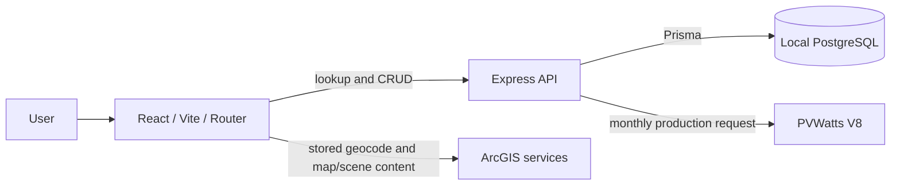

# Architecture

**Status: IMPLEMENTED PoC.** This application analyzes one residential address at a time on a local machine. React owns interaction and ArcGIS visualization; Express owns validation, persistence, and PVWatts access; PostgreSQL holds the local registry and saved runs. There is no authentication, deployment service, or background worker.

## Main flow and boundaries

1. The browser posts a trimmed, whitespace-collapsed address to `POST /api/properties/lookup`. Express applies its deterministic case normalization and checks the unique `Property.normalizedAddress` column.
2. On a miss, the browser calls the ArcGIS geocoding service with `forStorage=true`, WGS84 output, and precise address-match checks. It posts the selected display address and coordinates to `POST /api/properties`. Express validates latitude/longitude and creates or returns the unique local Property. Optional property details are entered by the user; ArcGIS does not supply them in this workflow.

   The address match is a location lookup, not a determination of residential land use, ownership, parcel extent, or roof suitability.
3. The ArcGIS Maps SDK for JavaScript Map Components render the target marker in Map or a terrain-backed 3D scene. A user-drawn, closed WGS84 GeoJSON polygon can be saved with the Roof Profile as a visualization aid. The polygon is not used as measured roof area. Scene lighting uses the selected date/time and UTC offset; a roof outline can constrain a `ShadowCastAnalysis` overlay. No shadow output is transferred to PVWatts.
4. The Roof Profile and Solar System each have one current record per Property. Express validates their inputs and saves them through Prisma. `POST /api/solar/estimate` reads current records and saved Property coordinates; only Express calls PVWatts V8, with monthly output. The response is reduced to twelve AC kWh values, annual AC kWh, optional resource information, and warnings.
5. Historical bills are twelve USD values per Property and year, written atomically with a `(propertyId, year, month)` uniqueness constraint. Annual household consumption is a separate kWh input. The current UI does not infer consumption from bills, hourly grid flows from annual/monthly energy, or dollar savings from either.
6. `POST /api/analysis-runs` creates an `AnalysisRun` tied to the Property. A JSONB snapshot stores the Property details/coordinates, roof and system assumptions, monthly and annual production/warnings, bill year and values, and annual consumption. Separate summary columns support History. `PUT /api/analysis-runs/:id` updates only that run and cannot move it to another Property. `POST /api/solar/estimate-preview` uses the run's frozen coordinates when estimating edited roof/system assumptions. Viewing a run uses the saved snapshot even if current Property records later change. Deleting a Property cascades to its runs.

## Interface and API

| Surface | Responsibility |
| --- | --- |
| `/analyze` | Search a Property; show a full-width Map/3D view first, then roof, sunlight, system, production, bills, and economics panels; create or edit a saved run using the Save control after those panels. |
| `/history` | List newest runs, filter by address, open View/Edit, and confirm Delete. |
| `GET /api/health` | Local API health response `{ "status": "ok" }`. |
| `/api/properties/*` | Local address, optional details, roof, system, bills, and consumption CRUD. |
| `POST /api/solar/estimate` and `POST /api/solar/estimate-preview` | Validate domain inputs and call PVWatts from Express. Preview edits do not mutate the current Property configuration. |
| `/api/analysis-runs` and `/api/analysis-runs/:id` | List, create, read, update, and delete snapshot runs. |
| `GET /api/economics/tariff-status` | Report reviewed rate-input status and missing inputs; it does not return an annual bill estimate. |

## React and ArcGIS lifecycle

The app renders one active Map or 3D custom element for the chosen mode. The canvas initializes its graphics layer after `viewOnReady`, updates marker/roof graphics as props change, and removes owned graphics, layers, and shadow analysis during cleanup. Property navigation wraps `goTo` in an `AbortController` so a subsequent property or unmount can cancel an obsolete camera move. React effects guard asynchronous loads against stale completions. A GIS initialization or navigation failure renders a retryable fallback rather than taking down the Analyze page. The application does not create a detailed house model or assume surrounding 3D buildings are present.

## Data and credential placement

| Data / credential | Location | Reason |
| --- | --- | --- |
| `VITE_ARCGIS_API_KEY` | Browser build | Map content and stored geocoding run in the browser. Treat this as a restricted browser key, not a hidden secret. |
| `DATABASE_URL`, `PVWATTS_API_KEY` | Express environment only | Prisma and PVWatts calls run on the server; neither value is returned by an API route. |
| `Property`, `RoofProfile`, `SolarSystemConfiguration`, `MonthlyElectricityBill`, `HouseholdConsumption`, `AnalysisRun` | Local PostgreSQL | Current working records and historical snapshots are separate. |
| Filed SCE price inputs | Versioned, source-referenced server modules | The verified import/export inputs cannot by themselves produce a customer-specific annual bill. |

**Status: PLANNED** annual utility economics requires confirmed customer eligibility, time-aligned load and solar generation, effective tariff coverage, and verified billing/settlement rules. **Status: DEFERRED** automatic roof extraction and measured shading. See [methodology and limitations](methodology-and-limitations.md).
